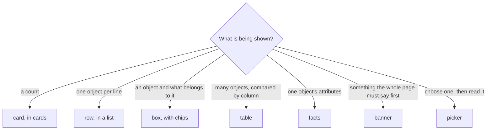

# Design standard

Every extension page is built from the components in `templates/src/renderer/styles/design.css`
and from nothing else that looks like one of them. The file is the same in every extension but
for its prefix, so a card, a row or a table reads identically whichever extension drew it — and
like the Freelens pages around it, because every colour is the host's.

## Contents

- [Rules](#rules)
- [Choosing a component](#choosing-a-component)
- [Components](#components)
- [Tones](#tones)
- [Inside the host's pages](#inside-the-hosts-pages)
- [Changing the standard](#changing-the-standard)
- [How it is enforced](#how-it-is-enforced)
- [Do not](#do-not)

## Rules

| Rule | Why |
|------|-----|
| Colours are host tokens: `--textColorPrimary`, `--colorError`, `--sidebarBackground`… | A literal looks right in the theme it was written in and wrong in the other, which is the half nobody checks |
| Everything that holds content sits on `--sidebarBackground` | A clear step from the page in both themes. `--contentColor` is the page itself; `--layoutBackground` equals the surface in the light theme |
| Hover on that surface is `--sidebarItemHoverBackground` | The host's own hover for the same surface, and visible in both themes |
| Anything pressable is a `<button>` | The keyboard and the screen reader. Every component that can be one resets `text-align`, which the browser centres |
| Spacing is `--unit` × ½, 1, 2, 3 | The host's density. No other gaps |
| Two text sizes: inherited, and `--font-size-small` | Plus the headline and a card's number. Nothing in `em` |
| A toggle says so with `aria-pressed`; a disclosure with `aria-expanded` | State in an attribute, not a class, so the look and the accessibility tree cannot disagree |
| A tone is the left edge and the state's colour — never a background | One signal per object; a coloured block drowns the text in it |

## Choosing a component



| If it… | Use | Not |
|--------|-----|-----|
| Is one number a reader acts on | `card` — a `<button>` when it opens the list behind it | A row with a big number |
| Needs a state, a name and a figure, and opens something | `row` | A table with one meaningful column |
| Has children worth naming (dependents, roles) | `box` with `chips` | Nested rows |
| Is compared across three or more attributes | `table` | A grid of `div`s: a real `<table>` keeps columns aligned and is read as one |
| Is an object's name → value pairs | `facts` (`<dl>`) | A two-column table |
| Changes how everything below it must be read | `banner` | A red subline |

## Components

`P` is the extension's prefix (`__Name__` in the templates). Every page's root carries `P` itself,
which holds the tokens; a page's layout class goes beside it: `className="P P-page"`.

| Component | Markup | Parts and modifiers |
|-----------|--------|---------------------|
| Page | `<div class="P P-page">` | `__head` (first child: headline and sublines; optional `__actions` beside it), `__headline`, `__subline`, `__subline--alarm` |
| Section | `<section class="P-section">` | `__bar` (title first, last child pushed right), `__title`, `__note` |
| Cards | `<div class="P-cards">` of `P-card` | `__value`, `__label`; `--critical`, `--warning`, `--info`, `--ok`, applied only when the value is above zero |
| List of rows | `<div class="P-list">` of `P-row` | `__state`, `__main` (`__name` with `<b>` and `__meta`, then `__reason`), `__aside`, `__actions`; tone modifiers |
| Box | `<section class="P-box">` or `<button>` | `__head` (tag, `__title` with `__meta`, `__count`; a `<button>` when it toggles), `__reason`, then `P-chips`; tone modifiers |
| Chips | `<div class="P-chips">` of `P-chip` | `__meta`. A `<button>` chip opens the object; a `<span>` chip only names it |
| Tag | `<span class="P-tag P-tag--critical">` | Tones and `--neutral`; or a domain class that sets `color` |
| Table | `<table class="P-table">` with `thead`/`tbody` | Cells: `__number`, `__fill` (the one column that takes the rest and trails off), `__shrink` (every identifier: a severity, a CVE, a revision, a name); `__row--clickable` on a `tr` |
| Facts | `<dl class="P-facts">` | `dt`/`dd` pairs |
| Banner | `<div class="P-banner">` | `__title`, `__body`; `--critical` (default is warning) |
| Filters | `<div class="P-filters">` of `<button class="P-filter" aria-pressed>` | `__count` |
| Buttons | `<button class="P-button">` in `P-actions` | `--primary` (what the view is for), `--caution` (a write beyond the object in front of the reader); `P-icon-button` |
| Search | `<input type="search" class="P-search">` | `--wide` to take the bar's remaining width |
| Picker | `<div class="P P-picker">` | `__side` (filters, search, `__list` of `__item`), `__detail`; `__item` has `__name`, `__meta`, `__aside`; `__item--selected`; `__empty` |
| Text | | `P-muted`, `P-hint` (small, beside a control), `P-mono`, `P-truncate`, `P-link` (a button that navigates), `P-text--critical` and the other tones |

A row, in full:

```tsx
<button type="button" className="P-row P-row--critical" onClick={open}>
  <span className="P-row__state">Expired</span>
  <span className="P-row__main">
    <span className="P-row__name">
      <b>{name}</b>
      <span className="P-row__meta">{namespace} · {issuer}</span>
    </span>
    <span className="P-row__reason">{reason}</span>
  </span>
  <span className="P-row__aside">{timeLeft}</span>
</button>
```

A row that also carries a menu cannot be a button — a button may not hold another. It is a
`<div class="P-row">` whose `P-row__main` is the button, with `P-row__actions` after it.

A box:

```tsx
<section className="P-box P-box--critical">
  <div className="P-box__head">
    <span className="P-tag P-tag--critical">not ready</span>
    <span className="P-box__title">
      <code>{name}</code>
      <span className="P-box__meta">{kind} in {namespace}</span>
    </span>
    <span className="P-box__count">{count} certificates</span>
  </div>
  <p className="P-box__reason">{message}</p>
  <div className="P-chips">
    <button type="button" className="P-chip" onClick={open}>
      <span>{child}</span>
      <span className="P-chip__meta">{namespace}</span>
    </button>
  </div>
</section>
```

A table reads like the host's own lists — the header in the host's table header colour and in
sentence case, rows of the same height — so it does not look foreign beside the list one tab
over. Only the surface differs: it sits on the grey like every other box, with the page's colour
between its rows. A cell may break anywhere, so a column that must not break is `__shrink`;
otherwise the widest column squeezes a CVE id onto two lines.

`templates/src/renderer/components/stat-card.tsx` is the card, with the zero rule built in.

## Tones

| Tone | Token | For |
|------|-------|-----|
| critical | `--colorError` | Broken now: expired, failed, missing, never looked at |
| warning | `--colorWarning` | Broken later, or on its way: renewal failing, out of sync, pending |
| info | `--colorInfo` | Worth knowing, nothing wrong |
| ok | `--colorSuccess` | Fine, shown beside things that are not |

Tones are the host's in every extension, so a critical row reads the same wherever it is. A domain
whose users already know its colours — a scanner's severities, a CD tool's health dots — keeps
them in its own stylesheet, for its own marks only: a tag's text, a count, a dot. The edge of a
row and the number on a card stay tones.

## Inside the host's pages

A `KubeObjectListLayout`, a details drawer and a `ConfirmDialog` are the host's. What the extension
renders into one still needs the stylesheet, and has no `P` root above it.

| Where | Do |
|-------|----|
| A list page built on `KubeObjectListLayout` | Mount `<PStyles />` beside it. Give the layout its own class (`PApplications`), not `P`: the root would restyle the host's table |
| A details drawer item | Mount `<PStyles />` inside it |
| A dialog's message | Wrap it in `<div className="P">`, so tones resolve |
| A domain mark used in those places | Declare its palette on the mark as well as on the root (`:is(.P, .P-badge)`) |

## Changing the standard

Only here, in `templates/src/renderer/styles/design.css`, then copy it into every extension. In a
repository with `scripts/sync-design.sh`, that script does the copy; elsewhere,
`sed "s/__Name__/<Name>/g; s/__NAME__/<name>/g"` into each extension's `styles/design.css`.

A component one extension needs and the others might is a change to the standard, not a rule in
that extension's stylesheet. The extension's own stylesheet holds what is its domain alone — a
validity bar, a chain of objects, a status palette — and restyles nothing from `design.css`.

## How it is enforced

| Check | Catches |
|-------|---------|
| `scripts/sync-design.sh --check` (where the repository has it) | A copy edited in one extension, or not updated after the standard changed |
| `designViolations()` in the e2e harness, on every page | A box off the surface grey, a centred button, a table header that is not the host's, a pressed filter without the accent, a class of ours no stylesheet defines — a component renamed and left behind renders in browser defaults |
| Each extension's layout suite | Width, the headline's colour from the theme, the few drawn components |

## Do not

- Write a colour. Not for a hover, not for a border, not "just this grey".
- Give a component a second look in one extension. Change the standard, or use it as it is.
- Put a modifier class where an attribute says it: `aria-pressed`, `aria-expanded`, `disabled`.
- Use a `div` grid for tabular data, or a table for one object's facts.
- Put the root class on a host list layout.
