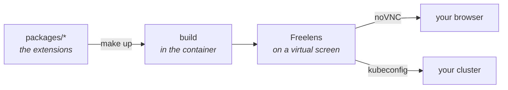

# freelens-addons

Extensions for [Freelens](https://freelens.app). Each one is packed as its own `.tgz` and installs
independently of the others.

## Extensions

| Extension | What it shows | Status | Docs |
|-----------|---------------|--------|------|
| ArgoCD | Applications ordered by what is wrong, with actions on each row | Working, reads and writes | [docs/argocd.md](docs/argocd.md) |
| Trivy | Scan coverage first, then findings and upgrades | Working, read-only | [docs/trivy.md](docs/trivy.md) |
| cert-manager | Certificates that will fail to renew, and why | Working, reads and renews | [docs/cert-manager.md](docs/cert-manager.md) |
| CloudNativePG | Postgres clusters that need attention, and whether each can be restored | Working, reads and writes | [docs/cnpg.md](docs/cnpg.md) |
| MongoDB | MongoDB clusters that need attention, which member is primary, and why one is stuck | Working, reads and writes | [docs/mongodb.md](docs/mongodb.md) |
| Redis | Redis replications, clusters, standalones and sentinels that need attention, which pod is master, and what fails it over | Working, reads and writes | [docs/redis.md](docs/redis.md) |

## Compatibility

Tested on **Freelens 1.10.3**, the version the dev container runs and the e2e suites drive.

| | Tested | Declared |
|-|--------|----------|
| Freelens | 1.10.3 | `engines.freelens: ^1.10.3`. Freelens keeps only `MAJOR.MINOR`, so any 1.x from 1.10 installs; 2.x is refused |
| Kubernetes | k3s v1.36.4 | — |
| ArgoCD | v3.5.2 | — |
| Argo CD Image Updater | v1.3.0 | v1.0 or later (needs the `ImageUpdater` CRD) |
| Trivy operator | v0.34.0 | — |
| cert-manager | v1.21.2 | — |
| CloudNativePG | 1.30.0 | — |
| MongoDB Controllers for Kubernetes (Community) | 1.12.0 | — |
| redis-operator (OT-Container-Kit) | v0.26.0 | — |
| Barman Cloud plugin | v0.15.0 | Optional; the in-tree object store and volume snapshots are read too |

## Installing

1. Download the `.tgz` from a release.
2. In Freelens, open File → Extensions and give it the path to the file, or drag the file onto the window.
3. The extension starts disabled. Find `@freelens-addons/<name>`, open its `⋮` menu and choose Enable.
4. Open a cluster and pick "All Namespaces" in any list.

The sidebar group appears only on clusters that run the tool (ArgoCD, cert-manager, the Trivy
operator, CloudNativePG, MongoDB Controllers for Kubernetes or the redis-operator). If it does not appear, see [docs/distribution.md](docs/distribution.md).

## Developing

You need Docker and a kubeconfig. Node, pnpm and Freelens run inside the container.



```bash
make up
```

The first run writes `.env` and stops. Set `KUBECONFIG_PATH` in it and run again. The second run
builds the extensions, starts Freelens on a virtual screen and prints a URL to open it in a browser.
Run `make up` again after every change.

| Command | What it does |
|---------|--------------|
| `make up` | Build, then start or restart |
| `make down` | Stop |
| `make test` | The test suites, with their coverage thresholds |
| `make check` | What CI runs, minus the scanners |

For a disposable cluster to develop against, see [dev/cluster/README.md](dev/cluster/README.md).
The rest is in [docs/development.md](docs/development.md).

## Documentation

| Document | Contents |
|----------|----------|
| [argocd.md](docs/argocd.md) | The ArgoCD extension |
| [trivy.md](docs/trivy.md) | The Trivy extension |
| [cert-manager.md](docs/cert-manager.md) | The cert-manager extension |
| [cnpg.md](docs/cnpg.md) | The CloudNativePG extension |
| [mongodb.md](docs/mongodb.md) | The MongoDB extension |
| [redis.md](docs/redis.md) | The Redis extension |
| [development.md](docs/development.md) | The development loop and adding an extension |
| [architecture.md](docs/architecture.md) | How the workbench runs and what the extension loader requires |
| [testing.md](docs/testing.md) | Test approach and where the fixtures come from |
| [distribution.md](docs/distribution.md) | Cutting and installing a release |
| [security.md](docs/security.md) | Supply-chain rules and what CI enforces |

## Licence

Apache 2.0.
