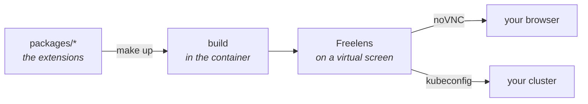

# freelens-addons

Extensions for [Freelens](https://freelens.app). Each one answers a question the tool leaves open.

Freelens shows a cluster's objects well. It does not rank them, join them across kinds, or tell
you when it failed to read one. These extensions are built around that missing judgement: what to
look at first, and what an absence means.

Everything is developed and tested inside Docker against a real cluster. The machine needs Docker
and nothing else.

## Extensions

| Extension | What it answers | Status | Docs |
|-----------|-----------------|--------|------|
| ArgoCD | What should I look at first, and can I fix it here? | Working, reads and writes | [docs/argocd.md](docs/argocd.md) |
| Trivy | Did the scanner actually look, and what should I upgrade? | Working, read-only | [docs/trivy.md](docs/trivy.md) |
| cert-manager | Which certificates will not be there when they are needed, and why? | Working, reads and renews | [docs/cert-manager.md](docs/cert-manager.md) |

Each extension packs into its own `.tgz` and installs on its own. None needs the others.

## Installing

Download the `.tgz` from a release. In Freelens, open File → Extensions and give it the path to
the file, or drag the file onto the window.

A newly installed extension arrives disabled:

1. File → Extensions, find `@freelens-addons/<name>`, open its `⋮` menu and choose **Enable**.
2. Open a cluster and pick "All Namespaces" in any list.

The group appears in the sidebar only on clusters that run the tool (ArgoCD, cert-manager or the
Trivy operator). When it does not appear, [Enabling an extension](docs/distribution.md#enabling-an-extension)
has a table of causes.

## Developing

You need Docker and a kubeconfig. Node, pnpm and Freelens all run inside the container.

```bash
make up
```

The first run writes `.env` and stops. Set `KUBECONFIG_PATH` in it and run again. The second run
builds the extensions, starts Freelens in a container, and prints a URL. Freelens runs on a
virtual screen, reachable in a browser, with the extensions already installed and enabled.



Run `make up` after every change. Freelens caches an extension's bundle for the life of the
process, so rebuilding without restarting shows you the previous build.

| Command | What it does |
|---------|--------------|
| `make up` | Build, then start or restart |
| `make down` | Stop |
| `make test` | The test suites, with their coverage thresholds |
| `make check` | What CI runs, minus the scanners |

More in [docs/development.md](docs/development.md).

## Documentation

| Document | What is in it |
|----------|---------------|
| [argocd.md](docs/argocd.md) | The ArgoCD extension: what it shows, what it changes |
| [trivy.md](docs/trivy.md) | The Trivy extension: coverage before findings |
| [cert-manager.md](docs/cert-manager.md) | The cert-manager extension: the renewal that fails while everything reads as fine |
| [development.md](docs/development.md) | The loop, adding an extension, why one does not appear |
| [architecture.md](docs/architecture.md) | How the workbench runs, and what the extension loader demands |
| [testing.md](docs/testing.md) | Why there are no mocks, and where the fixtures come from |
| [distribution.md](docs/distribution.md) | How a release is cut and installed |
| [security.md](docs/security.md) | The supply-chain rules and what CI enforces |

Every extension gets its own page there, in the same shape: what it is for, what it shows, what it
will not do.

## Licence

Apache 2.0.
