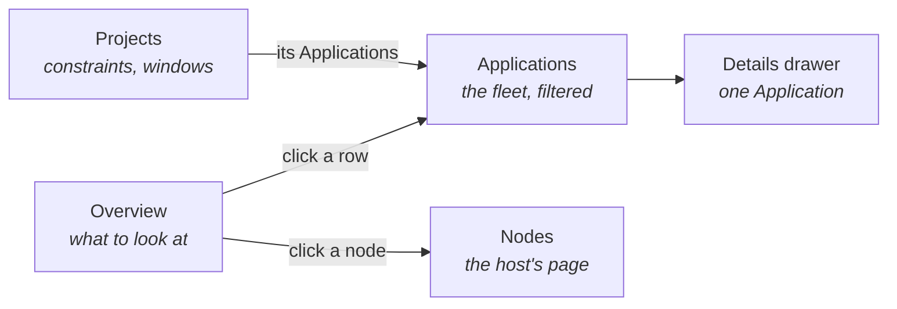

# ArgoCD Extension

**What it is for:** answering what you should look at first, then letting you act on it without
leaving Freelens.

ArgoCD's own web UI is a good place to inspect one Application. It is a poor place to scan a fleet
of them, because everything is one card per Application and a fleet only fits on screen as a grid
of colours. This extension gives the other view. It lists what is wrong in order of how bad it is,
puts the reason on the row, and puts the actions on the same row.

Nothing here needs an ArgoCD login. Every read and every write goes through the Kubernetes API
with the kubeconfig Freelens already holds.

## Contents

- [Pages](#pages)
- [What it shows](#what-it-shows)
- [What it can change](#what-it-can-change)
- [What it keeps](#what-it-keeps)
- [Design rules](#design-rules)

## Pages

## What it shows

The overview opens with a sentence saying how many Applications need attention, and then five
sections.

| Section | The question it answers |
|---------|-------------------------|
| Needs attention | What is degraded, stuck, failed to sync or cannot be compared with git (a branch or path that does not exist leaves health green and sync Unknown), ordered by severity and then by sync wave, with the drifting resources listed by name |
| Cluster pressure | What the cluster itself is saying, from node conditions and recent kubelet warnings. An Application that will not go Healthy is often waiting on a node |
| Syncing repeatedly | Which Applications sync over and over, which never surfaces as a failure |
| Recent rollouts | Deploys grouped by revision, so one commit landing on twelve Applications reads as one event |
| What the next commit can move | Which repositories and references the estate follows |

Applications and Projects are list pages with the actions on each row.

A row on the overview opens that Application in the list. A node under pressure opens the host's
Nodes page. Neither opens the details drawer directly, for the reason in
[Linking to a Kubernetes object](development.md#linking-to-a-kubernetes-object).

## What it can change

Every action is a patch through the Kubernetes API, and the same patch is available as a `kubectl`
command to copy.

| Action | What it writes |
|--------|----------------|
| Refresh, hard refresh | An annotation asking ArgoCD to re-compare against git |
| Sync | An `operation` field, with prune off unless ticked |
| Terminate | Clears `operation` on a sync in flight |
| Roll back | Syncs a revision from history, turning automated sync off with it |
| Freeze a project | A deny sync window on the AppProject |
| Refresh all, sync all | The same, across a project or a filtered set, four at a time |

Destructive actions confirm first, and the confirmation names what will happen.

## What it keeps

Pins and the remembered filter go in one JSON file per cluster, in the folder Freelens hands the
extension. Everything else is read from the cluster and never cached.

Pins surviving a restart took work. Freelens serves each cluster frame from an origin carrying the
proxy's port, that port changes on every launch, and browser storage is therefore wiped each time.
The file is per cluster because a pin names one Application in one cluster, and a shared file
would pin it everywhere.

## Design rules

The page never states a count it cannot stand behind. An unreachable cluster leaves an empty store
that would otherwise read as a healthy one, so the headline says it could not read rather than
reporting zero.

A first attempt failing is not a failure. The retry budget exists because early loads fail while
the cluster connects, so only a spent budget with nothing to show is called unreachable.

Logs open on the Application's own pods, resolved through its managed resources. The host's own
helper matches direct owners only and reports "no pods" for a Deployment.
