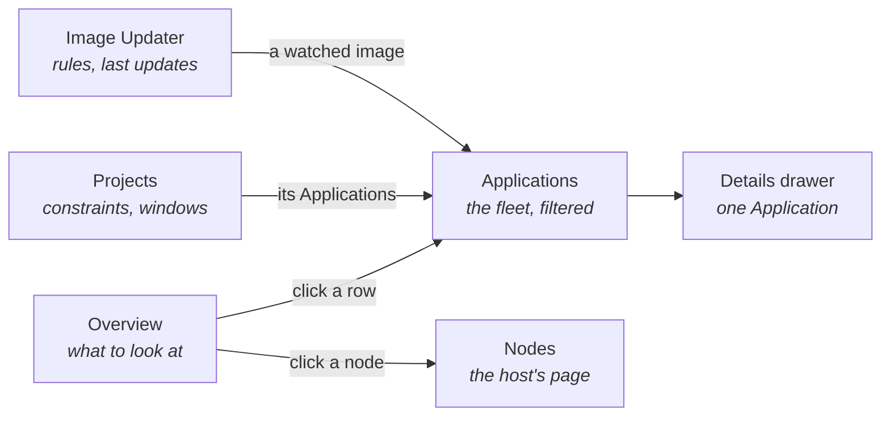

# ArgoCD extension

Shows which ArgoCD Applications need attention, worst first, with the reason and the action on the
same row. Everything goes through the Kubernetes API with the kubeconfig Freelens already holds, so
no ArgoCD login is needed.

## Contents

- [Pages](#pages)
- [Overview](#overview)
- [Applications and Projects](#applications-and-projects)
- [Image Updater](#image-updater)
- [Actions](#actions)

## Pages

Every page has the host's namespace selector.

## Overview

| Feature | What it shows |
|---------|---------------|
| Headline | How many Applications need attention |
| Cards | Counts by sync and health, each opening the filtered list |
| Needs attention | Degraded, stuck, failed or not comparable with git, worst first, with the drifting resources by name |
| Pins | Applications pinned to the top, kept per cluster |
| Cluster pressure | Node conditions and recent kubelet warnings |
| Syncing repeatedly | Applications that sync over and over |
| Recent rollouts | Deploys grouped by revision |
| What the next commit can move | The repositories and references the Applications follow |
| Component logs | ArgoCD's own pods, from the headline menu |

## Applications and Projects

| Feature | Where |
|---------|-------|
| Sync and health badges, resource drift, revision, destination | Applications list |
| Bulk Refresh, Hard refresh and Sync on ticked rows | Applications list |
| Sources, last sync, conditions, managed resources, images, deploy history | Application details drawer |
| Image Updater rules that watch the Application's images | Application details drawer |
| Allowed sources, destinations, roles, sync windows | Projects list |
| Refresh all, Sync all, Freeze, Resume | Project menu |

## Image Updater

For [Argo CD Image Updater](https://argocd-image-updater.readthedocs.io/) v1.0 or later. The group
appears only where the `ImageUpdater` CRD exists.

| Screen | Features |
|--------|----------|
| Overview | Rules that are failing, erroring behind `Ready=True`, not checking, or matching nothing; counts; Check now |
| Rules | Every rule with its state, Applications, images, last check and last update; a row opens the rule |
| Images | Each watched image: how it picks a tag, the Applications it reaches and the tag each runs, where updates are written; a row opens its rule; Edit |
| Updates | Each rule's last update, from which tag to which; a row opens its rule; Undo |
| Rule drawer | Controller log and Delete in the title bar; last update with Undo, images with Edit, commands to copy |

Rules, Images and Updates each count their rows, search them, and sort by any column.

## Actions

Every write asks first. A write that deletes, or that reaches several Applications at once, also
asks for a typed word. A write that has a simple reverse offers Undo in the notification that
reports it.

| Action | Note |
|--------|------|
| Refresh, Hard refresh | Re-compares with git; changes nothing in the cluster, so no typed word |
| Sync | Prune and Force are off unless ticked. Force deletes and recreates each resource. With either ticked, asks for the Application's name |
| Sync several | From the ticked rows, the overview or a project's Sync all. Asks for the word `confirm` |
| Terminate | Stops a sync in flight |
| Roll back | Syncs a revision from history and turns automated sync off |
| Freeze, Resume | Adds or removes a deny sync window on the project. Undo does the other |
| Pin, Unpin | Keeps an Application at the top of the overview, per cluster. Undo does the other |
| Copy commands | `argocd`, `kubectl` and a status summary |
| Check now | Restarts the Image Updater controller. Refused while a rule is failing, since the controller would not start |
| Edit an image | Constraint, strategy, allowed tags. Undo puts the previous settings back, refused if the image changed since |
| Undo an update | Puts the previous tag back. Pin keeps it there; Skip only ignores the undone tag. Not offered for rules that write to git. Undo puts the newer tag and the rule's settings back |
| Delete a rule | After typing its name |
