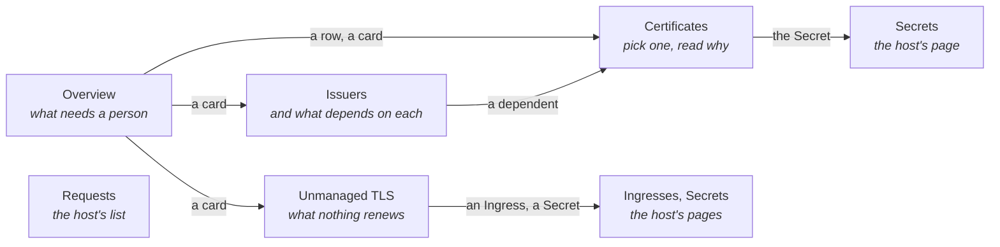
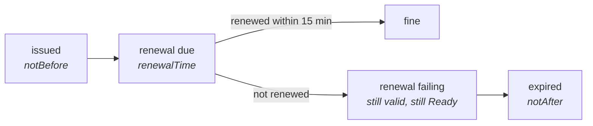
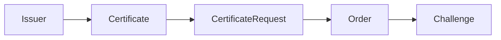

# cert-manager Extension

**What it is for:** saying which certificates will not be there when they are needed — expiring,
stuck, or never managed at all — and which object is holding each one up.

Freelens already lists cert-manager's kinds under Custom Resources, one kind per list, each row a
name and an age. What a list of those cannot show is the failure that matters most: a
certificate whose renewal is failing is still valid, still `Ready`, and reads as fine in every
list until the day it expires. The reason is usually three kinds away from it, on a Challenge or
an issuer, and each list shows one kind.

It writes one thing, and only when asked: a renewal, from the button on a certificate. Everything
else it gives you as a command to copy.

## Contents

- [Pages](#pages)
- [What needs attention](#what-needs-attention)
- [The chain, and the link that explains it](#the-chain-and-the-link-that-explains-it)
- [TLS nothing manages](#tls-nothing-manages)
- [Secrets are read by name only](#secrets-are-read-by-name-only)
- [Forcing a renewal](#forcing-a-renewal)
- [What it does not do](#what-it-does-not-do)

## Pages

Certificates and its detail are one page: pick on the left, read on the right. Requests is built on
the host's own list, so it is the one page here where the host's details drawer opens.

## What needs attention

Three things, and only three, because the list is for acting on.

| Problem | Severity | What it means |
|---------|----------|---------------|
| Expired | critical | Clients reject what is being served |
| Not ready | critical | There is no certificate to serve: never issued, or issuance failing |
| Renewal failing | warning | Still valid. Its renewal time passed more than fifteen minutes ago and it has not renewed |

Broken now comes before broken later, then less time left before more.

A certificate that merely ends within the month is **not** on the list. A ninety-day certificate
renewing on cert-manager's default spends its last third inside that window, so a third of all
healthy certificates would always be "needing attention". The 7- and 30-day windows are cards on
the overview instead, where they are information rather than a to-do list.

Nothing in a certificate says its renewal is failing. While its request waits on a broken issuer,
`failedIssuanceAttempts` stays empty — the request has not failed, it has simply not happened —
and `Ready` stays true. Lateness is the only signal, and fifteen minutes is longer than any
healthy renewal takes, ACME challenge propagation included.

## The chain, and the link that explains it

A Certificate makes a CertificateRequest per revision; an ACME request makes an Order; an Order
makes a Challenge per name. Each certificate's detail puts that line on one screen, with the issuer
at its head, and marks the link that causes the rest.

| Which link explains it | Why |
|------------------------|-----|
| An issuer that is not ready, or not there | It is the root cause even when the request's message only echoes it |
| Otherwise, the deepest link with something wrong that says why | A pending Order is pending because of its Challenge |

The current request is the one with the highest revision. cert-manager collects old requests, so
the history cannot be assumed. The commands offered point at the explaining object — `kubectl
describe` it — before offering `cmctl renew`, which only helps once that object is fixed.

## TLS nothing manages

An absence renders as nothing in every list cert-manager keeps: a certificate no Certificate
stands behind never appears, and nobody renews it. The Unmanaged TLS page looks from the other
side.

| What an Ingress serves | State |
|------------------------|-------|
| A Secret a Certificate writes | managed |
| A Secret that does not exist yet, which a Certificate will write | being issued |
| A Secret that exists, which no Certificate writes | no Certificate |
| A Secret that does not exist, which nothing will write | Secret missing |

The second list, TLS Secrets without a Certificate, is informational. Other controllers keep TLS
Secrets of their own — the API server its serving certificate, admission webhooks theirs — and
those are nobody's oversight.

## Secrets are read by name only

The host's Secret store lists Secrets with their data, so reading it would put every private key
in the cluster into Freelens' renderer each time a page opened. The extension asks the API server
for TLS Secrets as metadata only, which carries no data.

That alone is not enough. `kubectl apply` records the whole manifest it applied, values included,
in an annotation, and annotations are metadata. So every annotation except cert-manager's is
dropped the moment the response arrives. Listing TLS Secrets still needs permission to list
Secrets; without it the page says so rather than showing every served Secret as missing.

## Forcing a renewal

**Renew now**, in the head of a certificate's detail, does what `cmctl renew` does: sets the
certificate's `Issuing` condition, and cert-manager issues the next revision from the same issuer.
Nothing else is touched. The certificate being served keeps being served until the new one is
ready, and the button asks before it writes.

| When | The button |
|------|------------|
| cert-manager is not issuing it | Offered |
| Its issuer is broken or missing | Offered, and the confirmation says the renewal will fail until the issuer is fixed |
| cert-manager is already issuing it | Not offered: a second trigger changes nothing, and `cmctl renew` skips such a certificate too. The note beside the button names what is holding it up |

The condition lives on the status subresource, and a merge patch replaces a list whole, so the
patch carries every condition the certificate has with `Issuing` set, and the `resourceVersion` it
read. If cert-manager wrote the status in between, the API server refuses with a conflict and
nothing is written. It needs permission to patch `certificates/status`; without it the refusal says
so.

## What it does not do

| | Why |
|---|---|
| Issue or delete anything | The only write is a renewal, asked for. Everything else is a command to copy |
| Read `tls.crt` or `tls.key` | Expiry is already in the Certificate's status. Key material has no reason to reach the renderer |
| Judge external issuers | An issuerRef in another group — AWS PCA, Google CAS, step-ca — names objects this extension does not read. They are shown, not called missing |
| Read Gateway API listeners | Ingress only, for now. A Gateway's `certificateRefs` would complete the unmanaged-TLS picture |
| Configure ACME accounts or solvers | Configuration, not observation |
