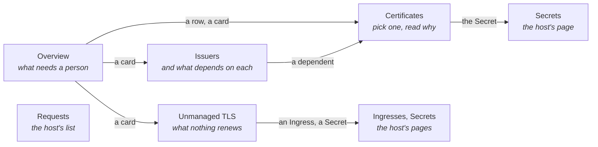
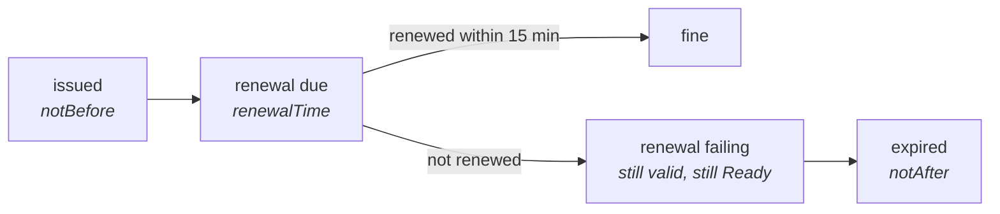

# cert-manager extension

Shows which certificates will not be there when needed (expiring, stuck, or managed by nothing) and
which object is holding each one up. Its only write is a renewal you ask for; everything else is a
command to copy. It never reads Secret data.

## Contents

- [Pages](#pages)
- [Renewal](#renewal)
- [The chain](#the-chain)
- [Features](#features)

## Pages

## Renewal

## The chain

## Features

| Page | Features |
|------|----------|
| Every page of its own | The host's namespace selector; narrowing it narrows the page at once. ClusterIssuers stay whatever is chosen |
| Overview | Expired, not ready and renewal failing, worst first; cards for certificates ending within 7 and 30 days, issuers and unmanaged TLS |
| Certificates | Picker with each certificate's state; validity bar with issue, renewal and expiry dates; the chain from issuer to challenge with the link that explains the state marked; commands to copy |
| Renew now | Same as `cmctl renew`. Asks first, naming the certificate; not offered while cert-manager is already issuing; warns when the issuer is broken. A notification says it was requested; there is no undo |
| Issuers | Each issuer with its state and the certificates that depend on it; issuers named and missing are counted with the broken ones |
| Requests | The host's list of CertificateRequests, each state as a dot and a word |
| Unmanaged TLS | Two tables, searched and sorted: Ingresses serving a Secret no Certificate writes, or a Secret that is missing; TLS Secrets without a Certificate. A row opens the host's list narrowed to it |
