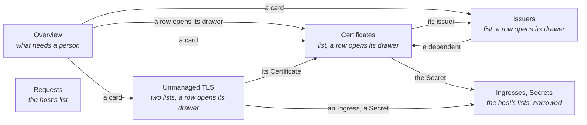
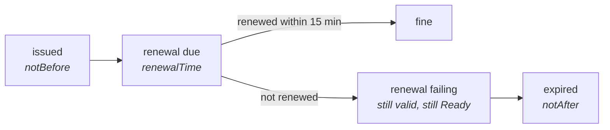

# cert-manager extension

Shows which certificates will not be there when needed (expiring, stuck, or managed by nothing) and
which object is holding each one up. Its only write is a renewal you ask for; everything else is a
command to copy. It never reads Secret data.

## Contents

- [Pages](#pages)
- [Renewal](#renewal)
- [The chain](#the-chain)
- [Features](#features)

## Pages

## Renewal

## The chain

## Features

| Page | Features |
|------|----------|
| Every page of its own | The host's namespace selector; narrowing it narrows the page at once. ClusterIssuers stay whatever is chosen |
| Overview | Expired, not ready and renewal failing, worst first; cards for certificates ending within 7 and 30 days, issuers and unmanaged TLS |
| Certificates | List with state, issuer, expiry and renewal, searched, sorted and narrowed by the chips. A row opens its drawer: the state and its cause, validity bar with issue, renewal and expiry dates, the chain from issuer to challenge with the link that explains the state marked, commands to copy. A route naming a certificate opens its drawer |
| Renew now | Same as `cmctl renew`, in the drawer's title bar. Asks first, naming the certificate; not offered while cert-manager is already issuing, and the drawer says why; warns when the issuer is broken. A notification says it was requested; there is no undo |
| Bulk renew | Tick certificates, then Renew. Type `confirm`; the ones already issuing are listed as skipped with the reason. One at a time, then the outcome |
| Issuers | List of Issuers, ClusterIssuers and those named and missing, broken first. A row opens its drawer: kind, type, state and cert-manager's message, the ACME server, email and account or the CA Secret's name, the certificates that depend on it (each opens its drawer), a command to copy |
| Requests | The host's list of CertificateRequests, each state as a dot and a word |
| Unmanaged TLS | Two lists, searched and sorted: Ingresses serving a Secret no Certificate writes, or a Secret that is missing; TLS Secrets without a Certificate. An Ingress row opens its hosts, the Secret, why nothing renews it, and the host's Ingress list narrowed to it. A Secret row opens its type, cert-manager annotations, why it is unmanaged, the Ingresses serving it, and the host's Secret list narrowed to it |
