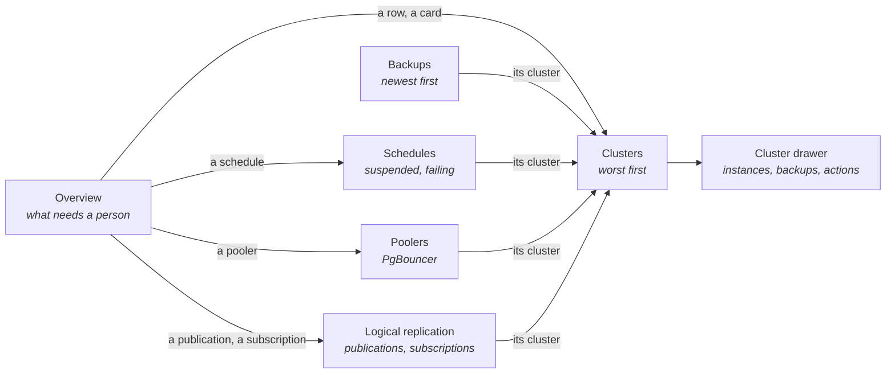
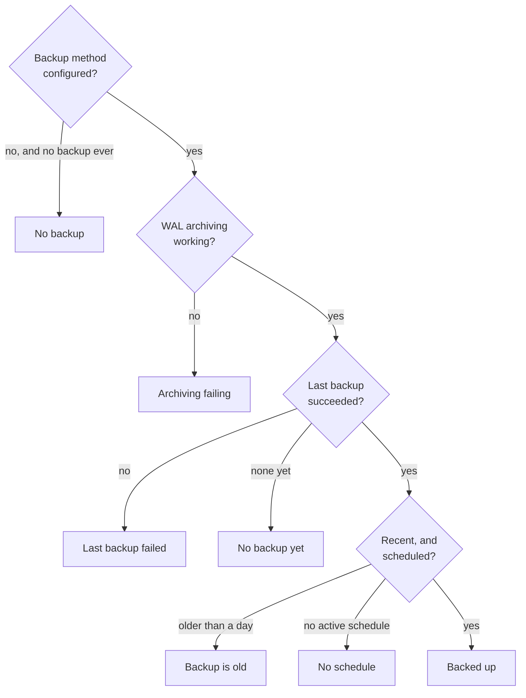

# CloudNativePG extension

Shows which Postgres clusters run by [CloudNativePG](https://cloudnative-pg.io/) need attention,
and whether each one can be restored from its backups. A cluster can be up while its WAL archive
has been failing for days; this extension puts the two side by side.

## Contents

- [Pages](#pages)
- [Can it be restored?](#can-it-be-restored)
- [Features](#features)
- [Actions](#actions)
- [What it will not do](#what-it-will-not-do)

## Pages

The group appears only where the `clusters.postgresql.cnpg.io` CRD exists. Every page has the
host's namespace selector.

## Can it be restored?

Reads the Barman Cloud plugin (its `ObjectStore` holds the recovery window), the in-tree
`barmanObjectStore`, and volume snapshots.

## Features

| Page | Features |
|------|----------|
| Overview | Clusters not ready, backups at risk, clusters with no backup, hibernated clusters, poolers down; a list of what needs attention, worst first, including expiring certificates and broken volumes |
| Clusters | State, ready instances, primary, replicas, worst replica lag, backup state and last backup per cluster; searched and sorted; a row opens the drawer |
| Cluster drawer | Primary, last switchover, recovery window, system ID, WAL position, how long Postgres has been up and the size of each database (from the primary's metrics exporter), image; instances with the primary first and marked, then the replicas, each with its node, QoS class, timeline and lag (bytes behind and replay delay, read from each instance as `kubectl cnpg status` does), and a pending restart; replication slots with the WAL each keeps; managed roles and tablespaces, with the error of one not applied; disruption budgets; the node maintenance window; every instance's postgres log in one list, by level, repeats folded; volumes that are dangling, unusable or still initializing; recent backups and schedules; certificates and when each expires; poolers; recent warning events of the cluster, its instances, volumes and backups; commands to copy |
| Backups | Every Backup with its state, the operator's error when it failed, method, duration and age |
| Schedules | Every ScheduledBackup: active, suspended, last run failed, or pointing at a missing cluster; cron, last and next run |
| Poolers | Every Pooler: active, inactive, paused, or in front of a missing or stopped cluster; type, pool mode, instances |
| Logical replication | Every Publication and Subscription: applied, or the operator's reason it is not; cluster, database, name in Postgres, what it carries |

Every state shows its reason beside it. When a backup or WAL archiving fails, the operator records
only an exit status; the extension reads barman's own error from the primary's log (the plugin's
sidecar, or postgres for the in-tree method) and shows it as the cause on the overview, the
clusters list, the schedules list and the cluster drawer. Logs are read only for failing clusters.

A hibernated cluster reads "healthy" in its phase. The extension reads the hibernation annotation
and condition instead.

## Actions

Cluster actions are in the drawer's title bar; schedule and pooler actions in each row's menu. Every
write asks first.

| Action | Note |
|--------|------|
| Back up now | Creates a Backup, as `kubectl cnpg backup` does: the cluster's method (or a volume snapshot when it declares one), from the cluster's default target, a standby or the primary. A volume snapshot can also be offline (Postgres stops on the instance), checkpoint at once, or skip waiting for the closing WAL to be archived. Refused when no method is configured |
| Reload | Re-reads configuration and certificates. Restarts nothing |
| Switch over | Promotes a healthy replica you pick. Asks for the cluster's name. Refused unless the cluster is healthy and has a replica |
| Hibernate, Wake | Stops the cluster and keeps its volumes, or brings it back. Hibernate asks for the name. Undo does the other |
| Restart | Rolling restart, replicas first, then a switchover. Asks for the name |
| Restart an instance | From its row's menu. The primary restarts in place, without a switchover; a replica's pod is deleted and recreated. Asks for the instance's name |
| Destroy an instance | From its row's menu, as `kubectl cnpg destroy` does: its pod, jobs and volumes; the operator builds a new replica. Refused for the primary and a single-instance cluster. Asks for the name |
| Node maintenance window | Start or end it, and choose whether a drained node's volume is waited for or the instance rebuilt elsewhere, as `kubectl cnpg maintenance` does. Undo does the other |
| Restart replicas | Deletes each replica's pod, one at a time, waiting for it to be Ready again on its volume. The primary is left alone. Asks for the name |
| psql | Opens a terminal tab running psql as `postgres` on the primary (title bar) or on any instance (its row), as `kubectl cnpg psql` does. Closing the tab ends the session. Refused while hibernated |
| Log | Opens an instance's postgres log in a log tab |
| Back up, Delete a backup | Back up is the page's button on Backups, for a cluster you pick. Delete, from a backup's row, asks for the name and removes the Backup object only; its files stay in the object store until the retention policy removes them |
| Back up now, Suspend, Start, Delete a schedule | From its row on Schedules. Back up now starts what the schedule would. Delete asks for the name, and takes the Backup objects it owns (their files stay). Undo reverses Suspend and Start |
| Delete a publication or subscription | From its row on Logical replication. Asks for the name. Postgres keeps it unless its reclaim policy is delete |
| Pause, Start, Delete a pooler | From its row on Poolers. Pausing holds new queries and keeps connections. Delete asks for the name. Undo reverses Pause and Start |
| Copy commands | `kubectl cnpg status`, `psql`, the operator's log, events |

## What it will not do

- Restore. A restore creates a new cluster from a backup; that is a manifest to review, not a button.
- Delete clusters or volumes.
