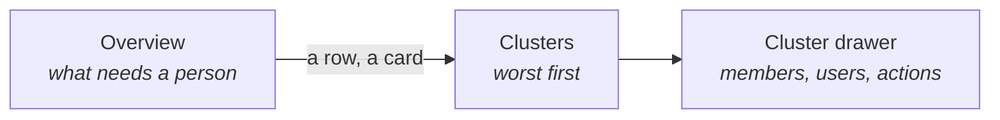
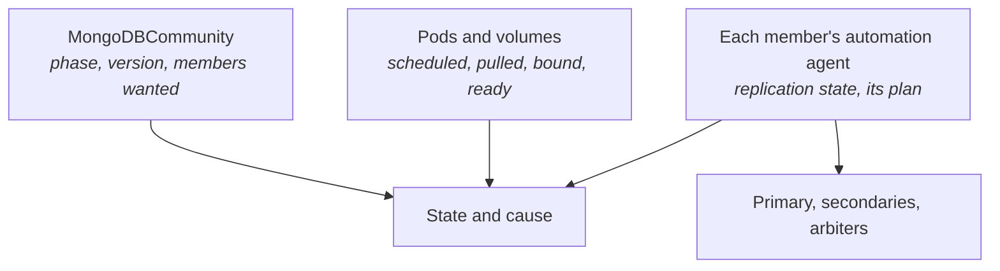

# MongoDB extension

Shows which MongoDB clusters (replica sets) run by [MongoDB Controllers for Kubernetes](https://github.com/mongodb/mongodb-kubernetes)
(MCK, Community mode) need attention, which member is primary, and why one is stuck. The operator
reports a stuck cluster as "not yet ready, retrying"; the cause is in a pod, a volume or the
automation agent, and this extension puts it beside the cluster.

## Contents

- [Pages](#pages)
- [Where the answers come from](#where-the-answers-come-from)
- [Features](#features)
- [Actions](#actions)
- [What it will not do](#what-it-will-not-do)

## Pages

The group appears only where the `mongodbcommunity.mongodbcommunity.mongodb.com` CRD exists. Every
page has the host's namespace selector.

## Where the answers come from

The status names no primary. Each member's agent writes its replication state and the plan it is
working through to a file in its pod; the extension reads that file through the API server, as
`kubectl exec` does, so it needs `pods/exec`. Without it the members show no role and the pages say
why. A plan's failed step is a cause only while the member is short of its goal: old plans keep
failed steps after a member recovers.

Secrets are listed as metadata only: names, and cert-manager's annotations to tell who issued a
certificate. Never their values.

## Features

| Page | Features |
|------|----------|
| Overview | Clusters down or failed, degraded, changing version; users whose password Secret is missing; a list of what needs attention, worst first, each with its cause |
| Clusters | State and cause, ready members, primary, TLS (and whether cert-manager issued it), version; searched and sorted; a row opens the drawer |
| Cluster drawer | Primary, version and feature compatibility, data members and arbiters, TLS with its Secret, its CA and whether cert-manager issued it, authentication, metrics, the connection URL to copy (without the password; a command gives the full one); members with their role, node, volume size, readiness, uptime, restarts and cause, the preferred primary marked; users with their roles and connection Secret, or the missing password Secret; recent warning events of the replica set, its pods and volumes, without the readiness-probe noise; commands to copy |

## Actions

Cluster actions are in the drawer's title bar; member actions in each member's row. Every write
asks first; the dialog closes on OK and the write reports by notification.

| Action | Note |
|--------|------|
| mongosh | Opens a terminal tab running mongosh on the primary (title bar) or a member (its row), with the first user's connection string, and the cluster's CA when TLS is on. The password is read in the terminal's shell, never by Freelens |
| Switch primary | Elects a ready secondary you pick by raising its priority in `memberConfig`, so it stays the preferred primary. Asks for the cluster's name |
| Scale | Changes the number of data members. Warns of an even vote, of the members removed and of a lone member |
| Restart all | Restarts the secondaries and arbiters one at a time, then the primary, which steps down as it stops so a secondary takes over at once; a preferred member takes the primary back when it returns. No priority is changed: the agents see a change at different times and would hand the primary back and forth. Each step waits for the set to settle, re-reads it, and stops if anything changed. Asks for the name |
| Restart a member | Deletes its pod; refused when the rest would be short of a majority. Asks for the member's name |
| Logs | A member's mongod or agent log in a log tab |
| Delete | Removes the cluster; its volumes are kept. Asks for the name |
| Restart, Delete (ticked rows) | Restart asks the operator for a rolling restart, which goes by index whatever the primary is. Both ask you to type `confirm` |
| Copy commands | `kubectl describe`, pods, an agent's log, the full connection string, `rs.stepDown()` |

## What it will not do

- Back up or restore. MCK Community has neither; they need Ops Manager.
- Create users or change passwords. That writes credentials.
- Pause a cluster. The operator has no such state.
- Change the MongoDB version or the feature compatibility. Upgrades are left to git.
