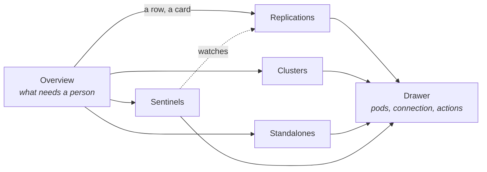

# Redis extension

Shows which Redis objects run by the [OT-Container-Kit redis-operator](https://github.com/OT-CONTAINER-KIT/redis-operator)
need attention, which pod is master, and what fails a replication over. The operator records no
status for a standalone or a sentinel; the extension reads their pods, volumes and events, and puts
the cause beside each one.

## Contents

- [Pages](#pages)
- [Where the answers come from](#where-the-answers-come-from)
- [Features](#features)
- [Actions](#actions)
- [What it will not do](#what-it-will-not-do)

## Pages

The group appears only where one of the operator's CRDs exists. Every page has the host's namespace
selector.

## Where the answers come from

| Fact | Source |
|------|--------|
| Master and replicas | The operator's `redis-role` label on each pod; it follows a failover about half a minute late |
| A replication's recorded master | `status.masterNode`; while it and the labels disagree, the replication reads "Changing master" |
| A cluster's state | `status.state` and `status.reason`, and the pods of its leader and follower StatefulSets |
| Why a pod is not up | Its volume, its scheduling, its containers |
| Who issued a TLS certificate | cert-manager's annotations on the Secret; Secrets are listed as metadata only, never their values |

## Features

| Page | Features |
|------|----------|
| Overview | Counts by kind, down or failed, degraded, replications no sentinel watches; what needs attention, worst first, with its cause |
| Replications, Clusters, Standalones, Sentinels | State and cause, ready pods, master and sentinels (replications), the replication watched (sentinels), TLS and whether cert-manager issued it, image tag; searched and sorted; a row opens the drawer |
| Drawer | State, master, sentinels or the replication watched, quorum, the operator's reason (clusters), image, password Secret, TLS with its Secret and issuer, connection URLs to copy (without the password); pods with role, group, node, volume, uptime, restarts and cause; recent warnings without the readiness-probe noise; commands to copy |

## Actions

Every write asks first; the dialog closes on OK and the write reports by notification.

| Action | Note |
|--------|------|
| redis-cli | Opens a terminal tab running redis-cli in a pod, with cluster mode, the sentinel port and TLS where they apply. The password is the pod's own `REDIS_PASSWORD`, expanded inside the pod: neither Freelens nor the terminal reads the Secret |
| Fail over | For a replication a sentinel watches: asks a ready sentinel to promote a replica, as `SENTINEL FAILOVER` does. Refused without a sentinel, a master or a ready replica. Asks for the name |
| Scale | Replications, clusters (at least three leaders) and sentinels. Warns of the pods removed, of resharding, of an even or short sentinel quorum, and of a lone pod. Undo puts the size back |
| Restart a pod | Deletes it; it comes back on its volume. Refused while another pod is down. Asks for the pod's name. Not offered for clusters |
| Restart all | Replications, standalones and sentinels: replicas one at a time, then the master, each waiting for the set to settle (pods ready, roles relabelled) and re-reading it first. Asks for the name; ticked rows can be restarted together |
| No cluster restart | A restarted cluster pod comes back on a new IP; redis-operator v0.26.0 neither rejoins it nor forgets the old node, and the cluster stays in Bootstrap. The drawer says so; a ticked cluster is skipped |
| Logs | A pod's log in a log tab |
| Copy commands | `kubectl describe`, the operator's log, the password from its Secret |

## What it will not do

- Back up or restore. The operator has neither.
- Delete a Redis object or its volumes.
- Edit ACLs or change passwords. That writes credentials.
