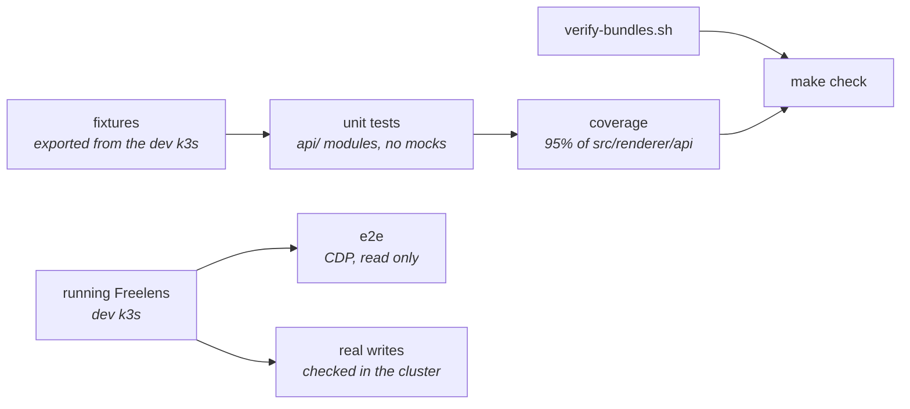
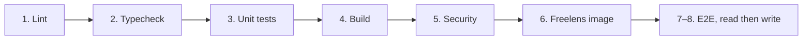

# Testing

## Contents

- [Layers](#layers)
- [Commands](#commands)
- [Unit tests](#unit-tests)
- [End-to-end](#end-to-end)
- [Real writes](#real-writes)
- [In CI](#in-ci)
- [Fixtures](#fixtures)
- [Rules](#rules)

## Layers



| Layer | Covers | Runs in |
|-------|--------|---------|
| Unit | Every decision in `src/renderer/api/` | `make check`, CI |
| Bundle check | Manifests and bundles Freelens would skip | `make check`, CI |
| End-to-end | Pages, controls, numbers, layout and design in the real app | `make e2e` (needs a cluster and a window), CI on `main` |
| Real writes | Each write done through the UI, its effect read back from the cluster | `make e2e-writes`, CI on `main` |

## Commands

```bash
make check
make e2e
make e2e-writes
```

Watch one package:

```bash
docker compose -f dev/docker-compose.yml --project-directory . \
  run --rm --no-deps --entrypoint sh -w /workspace freelens \
  -lc "cd packages/argocd && pnpm test:watch"
```

## Unit tests

Under test, `@freelensapp/extensions` resolves to `test/freelens-host.ts`, which re-exports the
real `KubeObject` and `KubeApi`. `getApi()` and `getStore()` throw, as they do before registration.

Decisions live in `api/` modules that take plain data and are covered. Modules that read a store or
send a patch are excluded and decide nothing.

| Decides, and is covered | Reads a store or sends a patch, and is excluded |
|-------------------------|--------------------------------------------------|
| `pressure.ts` | `cluster-health.ts` |
| `workload-selection.ts` | `workloads.ts` |
| `patches.ts` | `actions.ts`, `project-actions.ts` |
| `store-state.ts`, `pins.ts`, `persist.ts` | `use-argocd-stores.ts` |
| `image-updates.ts`, `image-updater-patches.ts`, `image-updater-tables.ts` | `use-image-updater-stores.ts`, `image-updater-actions.ts` |
| `coverage.ts`, `scan-progress.ts`, `subjects.ts` | `reports.ts`, `use-trivy-stores.ts` |
| `check-link.ts`, `rbac.ts`, `workload-rows.ts`, `installed.ts` | `use-rbac-stores.ts` |
| `namespace-scope.ts`, `table.ts` (every package) | `load-stores.ts`, `use-namespace-scope.ts` (every package) |
| `workload-pods.ts`, `workload-filter.ts` | `use-workload-pods.ts` |
| `clusters.ts`, `backups.ts`, `rows.ts`, `attention.ts`, `operations.ts`, `store-state.ts` (CloudNativePG) | `kinds.ts`, `actions.ts`, `use-cnpg-stores.ts` |
| `agent.ts`, `members.ts`, `replica-sets.ts`, `operations.ts`, `rows.ts`, `upkeep.ts` (MongoDB) | `kinds.ts`, `actions.ts`, `use-mongodb-stores.ts`, `use-agents.ts` |
| `nodes.ts`, `health.ts`, `operations.ts`, `rows.ts`, `upkeep.ts` (Redis) | `kinds.ts`, `actions.ts`, `use-redis-stores.ts` |
| `expiry.ts`, `attention.ts`, `chain.ts`, `issuers.ts`, `unmanaged.ts`, `certificate-filter.ts`, `commands.ts`, `secret-metadata.ts`, `renewal.ts`, `requests.ts` | `kinds.ts`, `actions.ts`, `use-cert-manager-stores.ts`, `use-tls-inventory.ts` |

Coverage: 95% of statements, branches, functions and lines in `src/renderer/api/`; `types.ts` is
excluded. React pages are covered by the e2e suite and `verify-bundles.sh`.

A case starts from a real fixture and changes only the field under test:

```ts
const stuck = variantOf("guestbook", (data) => {
  statusOf(data).operationState = {
    phase: "Running",
    startedAt: new Date(NOW - 20 * 60_000).toISOString(),
  };
});

expect(getAttentionItems([stuck], NOW)[0]?.headline).toBe("Sync stuck");
```

## End-to-end

`make e2e` restarts Freelens with `--remote-debugging-port=9222` (loopback only) and drives it over
the Chrome DevTools Protocol, one package at a time.

| Path | Holds |
|------|-------|
| `build/e2e/cdp.ts` | The protocol client, over Node's WebSocket |
| `build/e2e/freelens.ts` | Cluster frame, sidebar, namespace scope, dialogs, notifications |
| `build/e2e/design.ts` | `designViolations()` and `dialogColourViolations()` |
| `packages/<name>/e2e/` | Each extension's suite, `pnpm test:e2e` |

| File | Checks |
|------|--------|
| `pages-render.e2e.ts` | Every page opens and shows the cluster's rows |
| `controls.e2e.ts` | Every control does what its label says |
| `contents.e2e.ts` | Numbers match the cluster, asked through the host's proxy |
| `layout.e2e.ts` | No overflow; the design standard on every page |
| `filters.e2e.ts` | Filters narrow, empty and restore the list |
| `namespace-scope.e2e.ts` | Pages follow the namespace scope (one per extension) |
| `navigation.e2e.ts` | Row clicks land on the right page (Trivy) |
| `image-updater.e2e.ts` | The Image Updater screens, drawer and dialogs (ArgoCD) |
| `flow-pin.e2e.ts`, `flow-renewal.e2e.ts` | One flow each, start to end |

Actions that write (Sync, Refresh, Undo, Delete, Renew) are pressed up to their confirmation and
cancelled here; [real writes](#real-writes) press OK.

## Real writes

`make e2e-writes` runs each package's `e2e/*.writes.ts`: every write that deletes nothing is done
through the UI, as a person would, and its effect is read back from the cluster through the window's
own proxy. A test fails on what the cluster did, not on what the screen says.

| Rule | Why |
|------|-----|
| Only the dev k3s | `openWorkbench` refuses any other cluster |
| The write goes through the UI; the check through the API | `build/e2e/writes.ts`: `confirmDialog`, `clusterObject`, `untilCluster`, `execIn` |
| Each test leaves the seed as it found it | Through the extension's own Undo or reverse action where there is one, `restore()` otherwise |
| Delete and Destroy are left out | Nothing could put the object back as the seed made it |

| Package | Writes |
|---------|--------|
| ArgoCD | Refresh, hard refresh, sync (one, ticked, frozen), terminate, roll back, freeze and resume, refresh all, Check now, image edit and update undo |
| cert-manager | Renew, from the drawer and ticked |
| CloudNativePG | Back up (three ways), reload, switchover, restart (rolling, replicas, one instance), hibernate and wake, maintenance window, schedules, poolers |
| MongoDB | Switch primary, scale, restart a member, restart all, rolling restart |
| Redis | Failover, scale (replication and sentinels), restart a pod, restart all, ticked restart |

## In CI

One workflow, `.github/workflows/ci.yaml`, lightest first; each job runs only if the one before
it passed. `release.yaml` stays apart, on tags.



| Job | Runs |
|-----|------|
| 1–6 | Every pull request and push |
| 7–8 | Push to `main` and by hand: `make cluster`, `make e2e`, `make e2e-writes` on a fresh k3s. On a failure it prints Freelens' log, the pods and the cluster's warnings |

`make ci-local` runs the same workflow through [act](https://github.com/nektos/act), in a container
built from `dev/act/Dockerfile`, on a copy of the working tree, as another compose project on
other ports, so the dev setup keeps running. `JOB=lint` runs one job; `KEEP=1` leaves its cluster
and Freelens up.

## Fixtures

```bash
dev/cluster/cluster.sh fixtures          # every package
dev/cluster/cluster.sh fixtures argocd   # one
```

It reads the dev k3s, refuses any other cluster, and sanitises what it
writes (`dev/cluster/fixtures/sanitise.py`). Read the diff before committing.

| Removed or replaced | Reason |
|---------------------|--------|
| Node IPs, machine and system UUIDs, boot ID | Identify the host |
| Domains in `FIXTURE_REDACT_DOMAINS` | Private hostnames |
| Pod `env` values, `envFrom` | Credentials |
| Exposed-secret matches, ACME tokens and keys, last-applied annotations | Secrets |
| `managedFields`, `operationState.syncResult`, SBOM component lists | Size |

`metadata.selfLink` is filled in, since the client expects it.

## Rules

| Rule | Why |
|------|-----|
| No mocks | The real classes catch shapes a stand-in would get wrong |
| Never hand-write a fixture | Cause the state in the component's `dev/cluster/components/<name>/states.sh` instead |
| Time-dependent code takes `now` | Tests pass `fixtureNow()`; cert-manager's reads `exported-at.json` |
| A new test fails without its fix | Check by reverting the fix |
| e2e sets up its own state | Freelens remembers sidebar groups and starts scoped to one namespace |
| e2e follows a person's order | Narrow, look, widen, look |
| Change a loading path, run every `namespace-scope.e2e.ts` | The hooks share one pattern |
