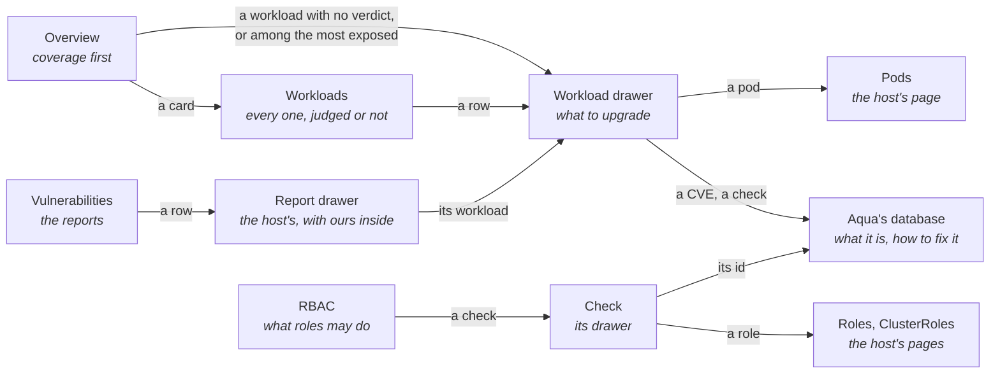
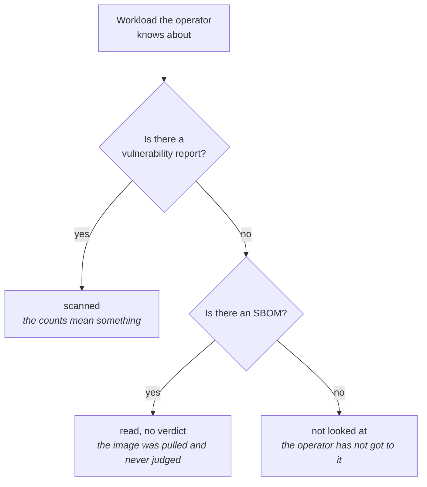

# Trivy extension

Shows whether the Trivy operator scanned each workload, then what it found. A workload with no
report looks the same as a clean one in a list of reports; this extension tells them apart. It
writes nothing to the cluster.

## Contents

- [Pages](#pages)
- [Coverage](#coverage)
- [Features](#features)

## Pages

## Coverage

## Features

| Page | Features |
|------|----------|
| Overview | Coverage, scan progress (working, stalled, stale, complete) with an estimate, the workloads with no verdict, then the most exposed once all are judged; the finding and workload cards open Workloads filtered to what they count |
| Workloads | Every workload with its kind, namespace, coverage state and counts (critical, high, other, fix published), filtered by state, searched and sorted by column; a row opens its drawer, and a link that names a workload opens the page on it |
| Workload drawer | The state and what clears it, findings grouped by package, fixable apart from unfixable, critical and high first, duplicates collapsed; its pods, one entry per container, failing config checks and exposed secrets; copy for a ticket in the title bar |
| Vulnerabilities | The host's list of reports, with severity counts; a row opens the host's drawer, where the extension adds the image, scanner, last update, counts by severity, the worst findings with a fix, and a link to the workload's drawer |
| RBAC | One row per failing check with how many Roles and ClusterRoles fail it, searched and sorted; a check's drawer gives the fix and every role, each opening the host's list narrowed to it |
| Namespaces | Every page carries the host's namespace selector and reloads when it changes; ClusterRoles reach every namespace, so they stay listed whatever is selected |
| Links | A CVE opens its advisory; a check such as `AVD-KSV-0021` opens its page in Aqua's database; a pod opens the host's Pods list narrowed to it |
| Copy for a ticket | From a workload's drawer, the upgrades it needs, as text to paste into a ticket |
