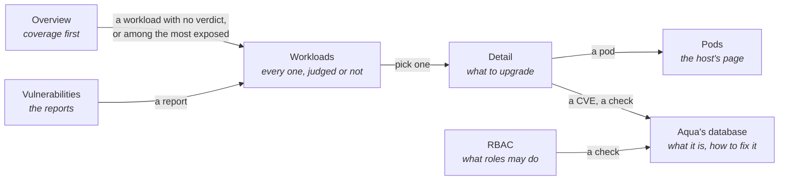
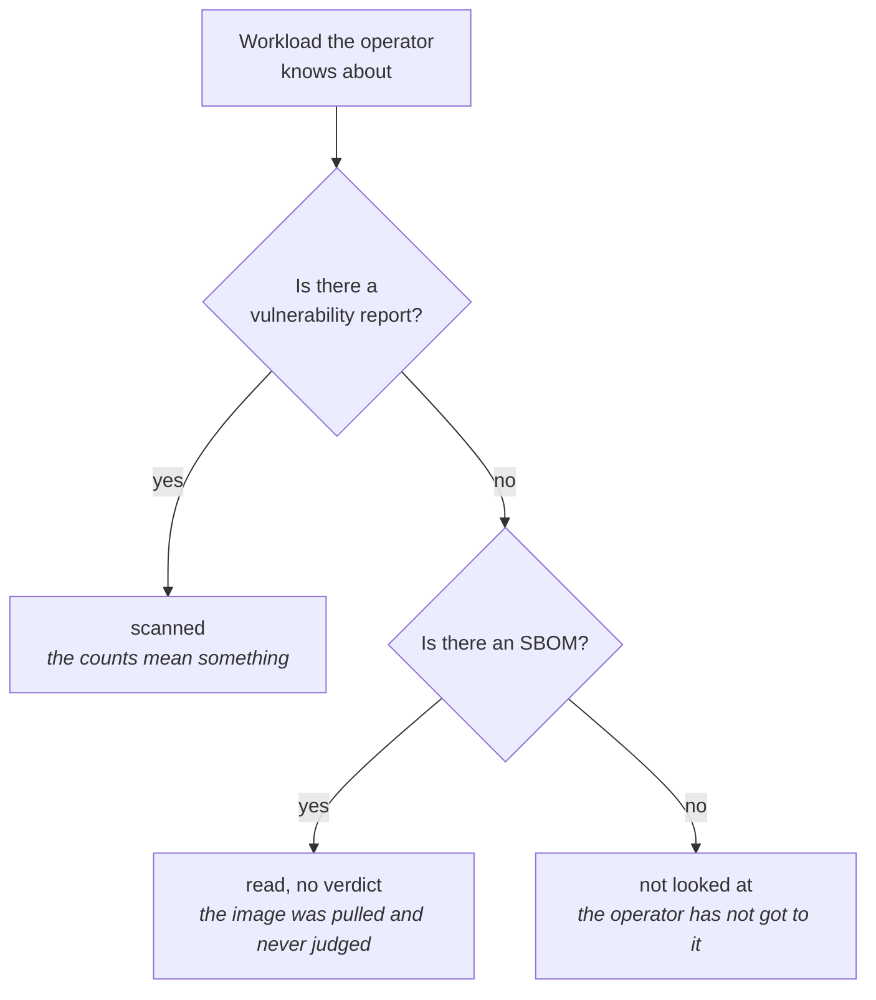

# Trivy Extension

**What it is for:** answering whether the scanner actually looked, before answering what it found.

Freelens already lists the Trivy operator's reports under Custom Resources. What a list of reports
cannot show is the workload it never reported on. An absence renders as nothing at all, so a
workload with no `VulnerabilityReport` looks exactly like one with nothing wrong.

Those two states can differ across most of a cluster. A scanner half way through a rescan, one
whose jobs are failing and one that has finished all look alike in a list of what it produced.

The extension writes nothing. Where an action would help, it gives you the command.

## Contents

- [Pages](#pages)
- [Coverage, which is the point](#coverage-which-is-the-point)
- [Wait or investigate](#wait-or-investigate)
- [Findings as work](#findings-as-work)
- [RBAC](#rbac)
- [What it does not do](#what-it-does-not-do)

## Pages

Workloads and its detail are one page: pick on the left, read on the right.

## Coverage, which is the point

Every workload the operator knows about falls into one of three states, and only the first makes
its findings worth reading.

Once every workload has a verdict, the overview lists the most exposed instead: the workloads
with the most critical findings, then high, each opening on its detail.

The list of known workloads is the union of every report kind. A ReplicaSet scaled away keeps its
SBOM after its config audit is collected, so taking a single kind as the roll would silently drop
it.

## Wait or investigate

The obvious question about a half-scanned cluster is why the scan failed, and the cluster cannot
answer it: the operator deletes its scan jobs as they finish, so by the time anyone looks there is
nothing left to read.

When each verdict was reached can be read, and that answers the question people actually have.

| State | What it means | What to do |
|-------|---------------|------------|
| `working` | Verdicts are still arriving | Wait. The page estimates how long from the rate it observed |
| `stalled` | Workloads are unjudged and nothing has arrived recently | Look at the operator |
| `stale` | Everything is judged, some older than the rescan interval | The numbers are real but out of date |
| `complete` | Everything judged and current | Nothing |

No estimate is offered when the observed rate is zero, which would otherwise print an infinity.

## Findings as work

Findings are grouped by package. One bump of `openssl` can answer thirty-two rows, and listing the
thirty-two hides how little work there is. The detail opens with how many upgrades clear how many
findings.

What has a published fix is kept apart from what does not. Everything Trivy produces puts them on
the same row, and they are different work: one is a version bump, the other a decision about
whether to keep running the image.

Critical and high come first. A third of a real cluster's findings come back `UNKNOWN` and would
bury the rest, so the counter always shows the true total and nothing pretends they are absent.

Duplicates are collapsed. The operator emits one row per Go binary embedding a module, with no
target to tell them apart, so an image can carry the same finding many times over. Counting those
separately overstates the work without naming anything new.

Containers are listed one by one. A workload of several gets one report each, with its own image
and its own scan time.

Every finding links to where it is explained. A CVE carries its own link in the report. A config
audit or RBAC check carries only its id, so the link is built from it — `AVD-KSV-0021` opens the
check's page in Aqua's vulnerability database, which says what it looks for and how to fix it. An
id not in that form gets no link rather than one to a missing page.

## RBAC

Roles and ClusterRoles are assessed for permissions they probably should not have, and the
findings are grouped by the check rather than by the role. One misconfiguration lands on many
roles at once and the remediation is the same sentence for all of them, so the check is the unit
of work: "Manage secrets" is one line covering however many roles hold it.

ClusterRoles come first within a severity, because one reaches every namespace.

## What it does not do

| | Why |
|---|---|
| Write to the cluster | Trivy is an audit tool, and one that mutates is a bad surprise. Actions are handed over as commands |
| Search for a CVE or a package | Left out on purpose. A workload's findings, and the host's Vulnerabilities list with its own filter, answer what was needed |
| Show compliance | The operator's ClusterComplianceReports carry a null status on the cluster this was built against: controls defined, a cron set, and no result ever written. A page for them would be empty rows |
